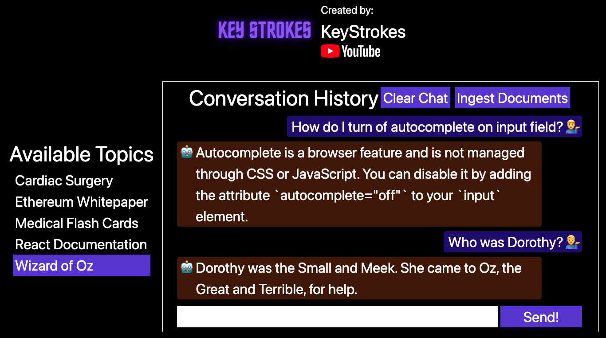

### Find me here 

[](https://www.youtube.com/@Key_Strokes) [](https://www.youtube.com/@Key_Strokes)

### Support me:

[](https://www.buymeacoffee.com/keystrokes) [](https://ko-fi.com/keystrokes) [](https://patreon.com/KeyStrokes)

# Chat App with ChatGPT API Integration

Personalize ChatGPT using LangChain, and get answers from your own documents and knowledge base.

## Video Link

[](https://youtu.be/han_3S2fPOU)

## Preview


# Running the app

Use the subsections below to:
1. Setup the backend, and start the server
1. Setup the frontend, and start the server

Note: Both the backend and frontend servers need to be running together, otherwise it will not work.

## Backend

Uses ExpressJS.

### Setup

1. Update `OPEN_AI_API_KEY` in `./backend/env/development.env` with your Open AI API Key.
1. Run the following commands to setup the backend

```
cd backend
npm install
```

### Start the server

Run the following command to start the server
```
npm run dev
```

## Frontend

Uses NextJS and ReactJS.

### Setup

Run the following commands to setup the frontend

```
cd frontend
npm install
```

### Start the NextJS server

Run the following command to start the NextJS server
```
npm run dev
```

Access the Chat page at http://localhost:3001/

## Note
Please note, this is for demonstration purposes only. Do not deploy this to production without making certain changes.

If you really want to deploy this to production, then you may following these steps:
* Add various protection to the APIs, like authentication, authorization throttling etc
* Do not store index files on the file system. Use a database, and add restrictions on the file types, size, etc, and make sure that user's don't use this as an attack vector to overload your server.

There are many other best practices that need to be implemented. But the above two summarize the most important ones. If someone really deploys this to production, then please send a pull request with a more comprehensive list.
